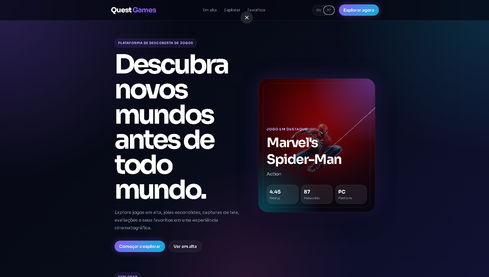

# 🎮 Quest Games

Uma plataforma moderna de descoberta de jogos desenvolvida com HTML, CSS e JavaScript puro utilizando a API da RAWG.



---

## ✨ Features

- 🔥 Jogos populares e famosos
- 🔎 Sistema de busca de jogos
- ❤️ Sistema de favoritos com LocalStorage
- 🌎 Internacionalização (PT-BR / EN)
- 📱 Layout totalmente responsivo
- 🎨 UI moderna estilo gaming platform
- 🎬 Hero section dinâmica
- 🖼️ Modal com detalhes do jogo
- 📂 Filtro por categorias/gêneros

---

## 🚀 Tecnologias

- HTML5
- CSS3
- JavaScript (Vanilla JS)
- RAWG API
- Vercel

---

## 📦 Instalação

Clone o projeto:

```bash
git clone https://github.com/SEU-USUARIO/quest-games.git
```

Abra o projeto:

```bash
cd quest-games
```

Depois basta abrir o `index.html`.

---

## 🔑 API

O projeto utiliza a API da RAWG:

https://rawg.io/apidocs

---

## 🌐 Deploy

Projeto hospedado na Vercel:

```txt
https://quest-games.vercel.app/
```

---

## 📸 Screenshots

### Desktop

Adicione screenshots aqui depois:

```txt
/assets/screenshots/desktop.png
```

### Mobile

```txt
/assets/screenshots/mobile.png
```

---

## 👨‍💻 Autor

Desenvolvido por Kaio Henrique.

- Portfolio: https://SEU-LINK.com
- LinkedIn: https://linkedin.com
- GitHub: https://github.com

---

## 📄 Licença

Este projeto está sob a licença MIT.
