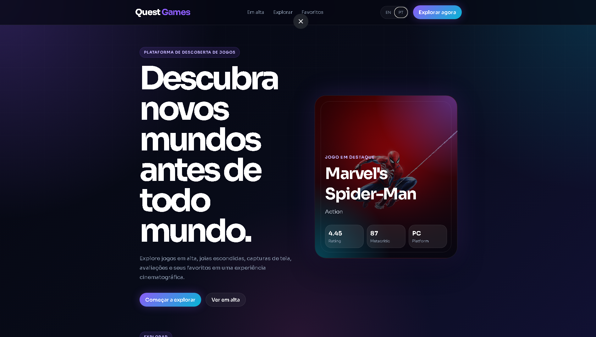

# 🎮 Quest Games

Uma plataforma moderna de descoberta de jogos desenvolvida com HTML, CSS e JavaScript puro utilizando a API da RAWG.



---

## ✨ Features

- 🔥 Jogos populares e famosos
- 🔎 Sistema de busca de jogos
- ❤️ Sistema de favoritos com LocalStorage
- 📚 Biblioteca pessoal com status: quero jogar, jogando e já joguei
- 🔍 Busca e filtros na biblioteca, com remoção de jogos
- 🌎 Internacionalização (PT-BR / EN)
- 📱 Layout totalmente responsivo
- 🎨 UI moderna estilo gaming platform
- 🎬 Hero section dinâmica
- 🖼️ Modal com detalhes do jogo
- 📂 Filtro por categorias/gêneros

---

## 🚀 Tecnologias

- HTML5
- CSS3
- JavaScript (Vanilla JS)
- RAWG API
- Vercel

---

## 📦 Instalação

Clone o projeto:

```bash
git clone https://github.com/SEU-USUARIO/quest-games.git
```

Abra o projeto:

```bash
cd quest-games
```

Depois basta abrir o `index.html`.

---

## 🔑 API

O projeto utiliza a API da RAWG:

https://rawg.io/apidocs

---

## 🌐 Deploy

Projeto hospedado na Vercel:

```txt
https://quest-games.vercel.app/
```

---

### Mobile

```txt
/assets/screenshots/mobile.png
```

---

## 👨‍💻 Autor

Desenvolvido por Kaio Henrique.

- Portfolio: [kaiohenrique.dev](https://kaiohenrique.dev/)
- LinkedIn: www.linkedin.com/in/kaiohenrique-dev
- GitHub: https://github.com/kaiokkj-dev

---

## 📄 Licença

Este projeto está sob a licença MIT.

## Biblioteca pessoal

Abra um jogo na página inicial e escolha seu status no seletor “Na minha biblioteca”. Acesse “Minha biblioteca” para buscar jogos salvos, filtrar por status e atualizar sua coleção. Os favoritos existentes são preservados. Os dados ficam salvos neste navegador via LocalStorage.

## Ícones

Ícones SVG da coleção [Lucide](https://lucide.dev/), armazenados localmente em `assets/icons`. Licenças e atribuições em `assets/icons/LICENSE`.

## Seleção em alta

Seleção editorial dos mais jogados na [Steam](https://store.steampowered.com/charts/mostplayed), consultada em 7 de outubro de 2026. Metadados e imagens vêm da RAWG. Títulos sem correspondência exata são omitidos. A lista não é um ranking ao vivo; revise `TRENDING_GAMES` em `js/api.js` para atualizar a seleção.

## O que jogar agora?

Na Minha biblioteca, use “Sortear um jogo” para escolher entre os títulos marcados como “Quero jogar”. O resultado permite abrir os detalhes e sortear novamente, evitando repetir o jogo anterior quando há mais de uma opção. O sorteio usa toda a lista Quero jogar, independentemente do filtro ou busca da biblioteca, e não altera os status salvos.
